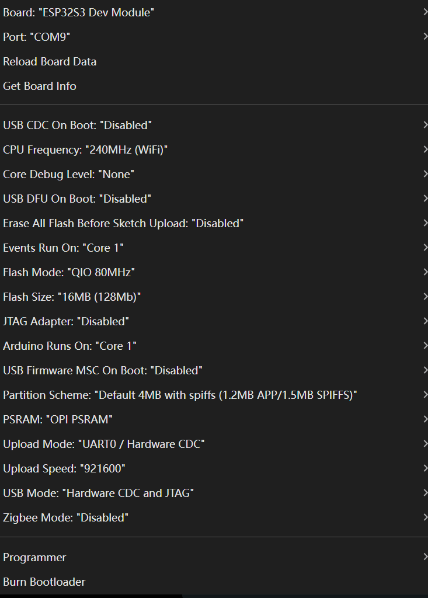

# ESP32-S3 Teachable Machine Camera Uploader

This project allows you to use an ESP32-S3 (N16R8/Sense/Eye) camera to stream real-time images to Google Teachable Machine for model training or recognition.

## Project Structure

- **TMUploader**: Arduino code for ESP32-S3. It captures 96x96 grayscale images and sends them via Serial.
- **TMConnector**: Processing script. It receives Serial data, displays a preview, and forwards images to the web interface via WebSockets.

## Setup Instructions

### 1. Hardware Preparation
- Ensure you are using an ESP32-S3 development board (boards with PSRAM like N16R8 are recommended).
- Connect the camera module to your board.
- And please set the board setting as the following (using ESP32-S3-N16R8 as an example):

### 2. Flash ESP32-S3 (TMUploader)
1. Open `TM_Uploader/TM_Uploader.ino` in Arduino IDE.
2. Select Board: `ESP32S3 Dev Module`.
3. Install required libraries:
   1. `esp_camera` (ESP32 Camera Library)
4. Enable **PSRAM** (OPI PSRAM).
5. Click "Upload".
6. Once successful, open Serial Monitor (115200 baud). You should see `ESP32-S3 Camera Ready!`.

### 3. Run Processing Script (TMConnector)
1. Download and install [Processing IDE](https://processing.org/).
2. Install required libraries:
   - In Processing, go to `Tools` -> `Add Tool...` -> `Libraries`.
   - Search and install `Websockets` and `ControlP5`.
3. Open `TM_Connector/TM_Connector.pde`.
4. Click the "Run" button.
5. In the pop-up window, select the **COM port** corresponding to your ESP32-S3 from the dropdown list.(remember to disconnect the serial monitor in Arduino IDE first)
6. You should now see a real-time 96x96 grayscale preview on the left.

### 4. Connect to Teachable Machine
1. Visit [Teachable Machine](https://teachablemachine.withgoogle.com/train/image).
2. Choose "Webcam" as the input source in the training interface.
3. Ensure the connection indicator (small dot on the right) in the Processing window turns green.
4. Processing is now simulating a webcam signal for the web interface.

## Key Features
- **Native Resolution**: Uses 96x96 resolution directly from the hardware, which is the standard input size for Teachable Machine. No extra cropping required.
- **Baud Rate**: Fixed at **115200** for stable communication.
- **Synchronization**: Uses a built-in `0xAA 0x55 0xAA` sync header to prevent image shifting or tearing.
